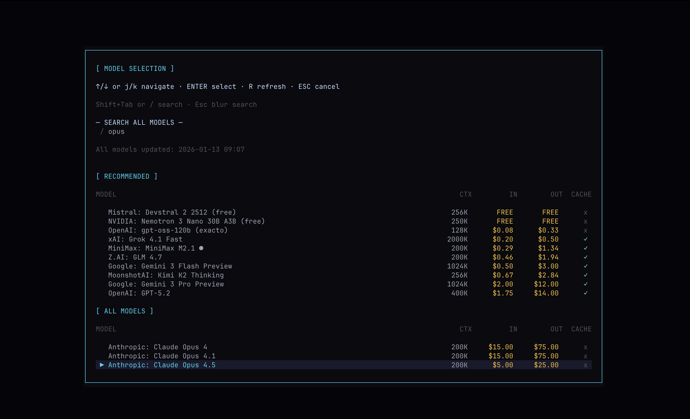
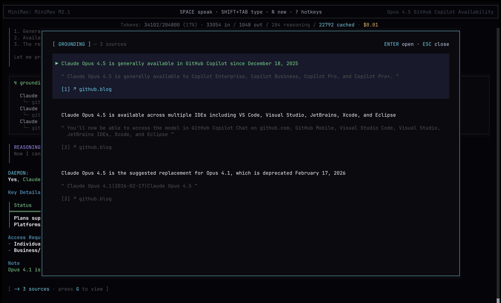
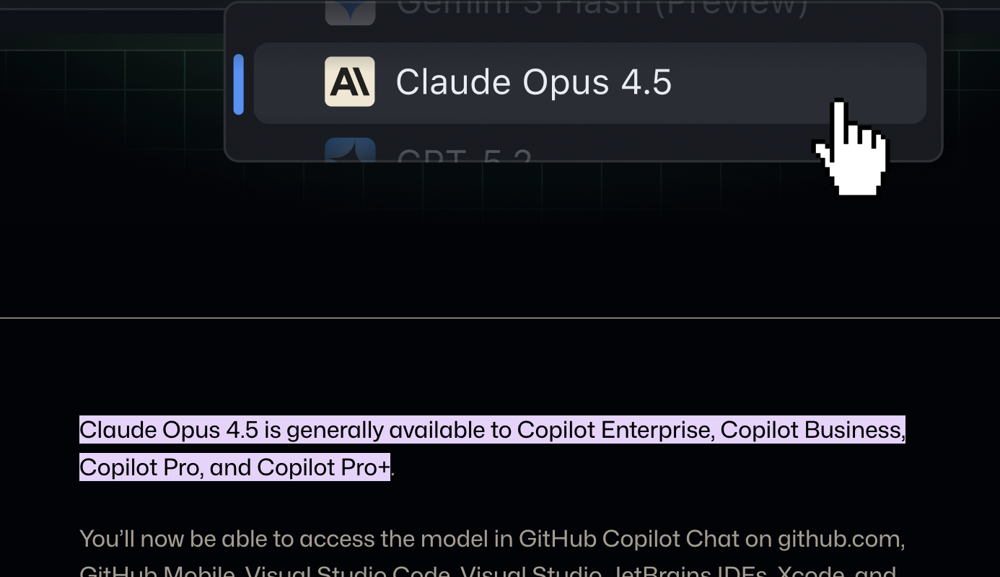
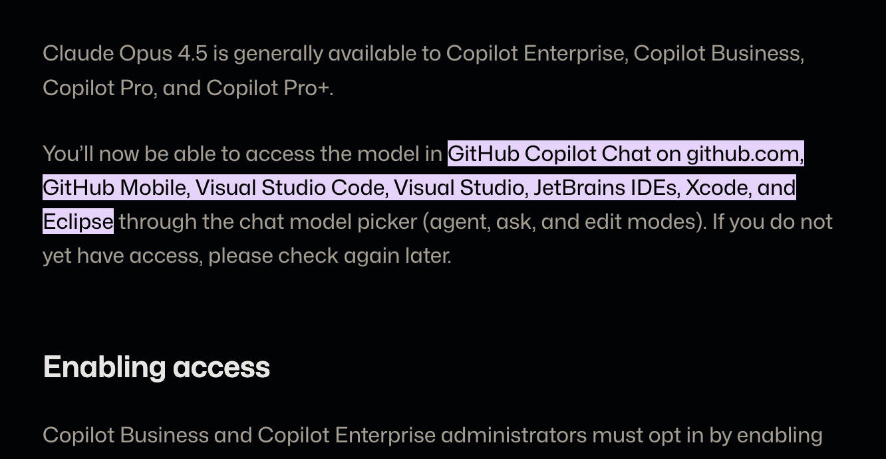

# ORPHEUS
**ORPHEUS** (pronounced "or-fee-us") is an opinionated **terminal-based AI agent** with distinct sci-fi theming,
delivered through a highly performant TUI powered by [OpenTUI](https://github.com/anomalyco/opentui).

It supports **text and voice interaction**, can be fully controlled through **hotkeys** and offers **vim-like controls**.

ORPHEUS is focused on **information-gathering workflows** that benefit from **grounded responses**
but can also interact with and **control** your system through the terminal with scoped permissions.


## Installation

ORPHEUS supports macOS, Linux, and Windows. It requires Bun at runtime, but global installation is currently documented via npm because some Bun global setups can fail on native `sqlite3` bindings pulled in by the optional memory feature.

```bash
# Install via npm
npm i -g @makefinks/orpheus

# Additional installs (Audio)
brew install sox 
```

Then run with:
```bash
orpheus
```

The legacy `daemon` command remains available as a compatibility alias.

#### ⚠️ Important Notes
> 1. ORPHEUS requires [Bun](https://bun.sh) at runtime. Install Bun first: `curl -fsSL https://bun.sh/install | bash`
> 2. Windows is supported for the terminal agent. Local shell commands run through PowerShell on Windows and through bash on macOS/Linux.

See full installation details below for configuration and system dependencies.

## Highlights

### 👤 Interactive Avatar
At the core of the TUI is ORPHEUS's **animated avatar**, reacting to what it's doing in real time:
listening to audio input, reasoning about questions, calling tools, and generating an answer.

The avatar was deliberately designed to feel slightly ominous and alien-like playing into sci-fi depictions.

### 🧠 LLMs
ORPHEUS supports two model backends:
- **OpenRouter** (API key based)
- **GitHub Copilot** (GitHub-authenticated via Copilot CLI / SDK) (Experimental!)

For OpenRouter, ORPHEUS can fetch and browse available models and route to a specific OpenRouter inference provider.
For GitHub Copilot, ORPHEUS can use your Copilot subscription and list available Copilot models when authenticated.




### 🎙️ Voice capabilities
SOTA transcription accuracy is achieved by using OpenAI's latest transcription model `gpt-4o-mini-transcribe-2025-03-20`.
It features a large vocabulary and can transcribe multilingual inputs with complex terminology.

OpenAI's TTS model `gpt-4o-mini-tts-2025-03-20` is used to generate voice output with as little latency as possible.

### 🔎 Web Search with Grounding
ORPHEUS uses the [Exa](https://exa.ai/) search and fetch API for retrieving **accurate** and **up-to-date information**.

After fetching relevant information, ORPHEUS has the ability to **ground** statements with **source links** that contain **highlightable fragments**.
The TUI comes with a menu for reading, verifying and opening sources for the current session.


For most statements, pressing Enter opens the source in your browser and **highlights the passage that supports the claim**.

<p align="center">
  
  
</p>
While ORPHEUS is encouraged to always cite sources you can always prompt to get groundings:

> "Use the grounding tool" / "Ground your answers"

### 💾 Session Persistence
ORPHEUS stores chat sessions locally (SQLite) and lets you resume past conversations.

### 🧠 Memory (mem0)
ORPHEUS can persist user-specific facts across sessions using [mem0](https://github.com/mem0ai/mem0). Memory extraction runs automatically on user messages and relevant memories are injected into the conversation when helpful. 

ORPHEUS can also mirror sanitized conversation turns into [Honcho](https://docs.honcho.dev/) for richer conversational context. Honcho is optional and loaded only when configured. Install `@honcho-ai/sdk`, then set `HONCHO_API_KEY` for managed Honcho or `HONCHO_BASE_URL` for a local Honcho server. Optional settings: `HONCHO_WORKSPACE_ID`, `HONCHO_USER_PEER_ID`, `HONCHO_ASSISTANT_PEER_ID`, or `HONCHO_ENABLED=true`.

## ✨ Feature List

| Feature | Description |
| --- | --- |
| Terminal TUI | OpenTUI-powered interface with sci-fi styling and hotkey controls. |
| Text + Voice | Supports text input and voice interaction with transcription and TTS. |
| Animated Avatar | Sci-fi avatar reacts to listening, tool use, and response generation. |
| Multi-Model Support | Works with OpenRouter and GitHub Copilot model backends. |
| Session Persistence | Preferences and chat sessions stored locally on disk. |
| Memory  | Automatic persistance of user-specific facts with persistent recall using **mem0** |
| Workspaces | Session-scoped on-disk workspaces for the agent to work in. |
| Web Search | Exa-based search and fetch for grounded, up-to-date info. |
| Grounding | Text-fragment grounding with a dedicated UI. |
| Security Snapshot | Read-only Windows posture score, prioritized fixes, cyber-readiness controls, and owner questions. |
| Local Shell Execution | PowerShell on Windows and bash on macOS/Linux, with approval scoping for potentially dangerous commands. |
| JS Page Rendering | Optional Playwright renderer for SPA content. |
| MCP | Model Context Protocol tools  |

## 📦 Install (npm)

ORPHEUS is published as a CLI package. It **requires Bun** at runtime, even if you install via npm.

To install Bun on macOS/Linux:
```bash
curl -fsSL https://bun.sh/install | bash
```
Then install ORPHEUS:
```bash
# Global npm install
npm i -g @makefinks/orpheus

# Then run
orpheus
```

Configuration is done via environment variables (or the onboarding UI):

- `OPENROUTER_API_KEY` (required only when OpenRouter is selected) - response generation via OpenRouter models
- `EXA_API_KEY` (optional) - enables web search + fetch grounding via Exa
- `OPENAI_API_KEY` (optional) - enables voice transcription + TTS
- `ORPHEUS_CONFIG_DIR` (optional) - override ORPHEUS's config directory. Legacy `DAEMON_CONFIG_DIR` is still honored.

For Copilot, authenticate once with either GitHub CLI or Copilot CLI:

```bash
gh auth login
# or
copilot login
```

> ⚠️ GitHub Copilot authentication support is experimental.

> Keys entered via the onboarding UI are stored locally in `~/.config/orpheus/credentials.json` with restricted permissions (`0600`). For maximum security, use environment variables instead.


## 🛠️ System dependencies

Voice input requires `sox` or other platform-specific audio libraries. Voice output effects require `ffmpeg`.

### macOS
```bash
brew install sox
```

### Linux (Debian/Ubuntu)
```bash
sudo apt install sox libsox-fmt-pulse
```

### Linux (Fedora)
```bash
sudo dnf install sox sox-plugins-freeworld
```

### Linux (Arch)
```bash
sudo pacman -S sox
```

### Windows
Install [Bun for Windows](https://bun.sh/docs/installation), then run ORPHEUS from PowerShell, Windows Terminal, or another terminal that supports TUI apps. For voice features, install `sox` and `ffmpeg` and make sure both commands are available on `PATH`.

## Local models with Ollama

ORPHEUS can use a local Ollama server for agent responses instead of OpenRouter or Copilot.

1. Install Ollama from https://ollama.com/download
2. Pull a tool-capable local model:

```powershell
ollama pull llama3.1:8b
```

3. Start ORPHEUS and choose **Ollama** during onboarding, or set preferences to use `modelProvider: "ollama"`.

ORPHEUS talks to Ollama through its OpenAI-compatible endpoint at `http://127.0.0.1:11434/v1`. Override this with `OLLAMA_BASE_URL` if your Ollama server runs somewhere else.

## Signal messaging

ORPHEUS can use a local `signal-cli` installation to list Signal accounts/contacts/groups, receive messages, and send messages. Sending a Signal message always goes through ORPHEUS's tool approval prompt.

Install and configure `signal-cli` first:

```powershell
# After installing signal-cli and linking/registering an account:
signal-cli -a +12025550123 listAccounts
signal-cli -a +12025550123 receive --timeout 1
```

Optional environment variables:

```powershell
$env:SIGNAL_CLI_ACCOUNT="+12025550123"
$env:SIGNAL_CLI_BIN="signal-cli"
$env:SIGNAL_CLI_CONFIG="C:\path\to\signal-cli-config"
```

Notes:
- `SIGNAL_CLI_ACCOUNT` can be omitted if `signal-cli` has exactly one local account.
- Recipients can be phone numbers, UUIDs, `PNI:` identifiers, or usernames prefixed with `u:`.
- `signal-cli` must stay current; the Signal service can break older clients.

## 🧩 Optional: JS-rendered page support (`renderUrl`)

ORPHEUS defaults to Exa-based `fetchUrls` for retrieving web page text. For JavaScript-heavy sites (SPAs) where `fetchUrls` returns "shell-only" content, ORPHEUS can optionally use a local Playwright Chromium renderer via the `renderUrl` tool.

This feature is **optional** and intentionally not installed by default (browser downloads are large). The render tool is not available to ORPHEUS without the installation below.

```bash
# 1) Install Playwright globally
npm i -g playwright

# 2) Install Chromium browser binaries
npx playwright install chromium
```
## 🔌 MCP server setup (Model Context Protocol)

ORPHEUS can load MCP tools from external servers and expose them to the agent at runtime.
MCP servers are configured via a local config file.

Default config path:

- macOS/Linux: `~/.config/orpheus/config.json`

Example config:

```json
{
  "mcpServers": [
    {
      "id": "local-mcp",
      "type": "http",
      "url": "http://localhost:3333/mcp"
    },
    {
      "type": "sse",
      "url": "https://example.com/mcp/sse"
    }
  ]
}
```

Notes:

- `type` must be `http` or `sse`.
- `url` is the MCP endpoint URL for the server.
- `id` is optional; if omitted, ORPHEUS derives one from the host.
- MCP server status and tools appear in the **Tools** menu once configured.
