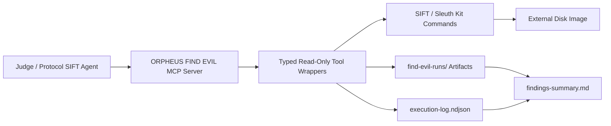

# FIND EVIL Architecture

## Architectural Pattern

Custom MCP Server.

## Security Boundaries

- The MCP server exposes only typed disk-image triage tools.
- It does not expose a generic shell command tool.
- The disk image path must be absolute and external to git.
- Tool outputs are written to the run directory, not back to the evidence path.
- Prompt guardrails are used for analyst behavior, but evidence protection is
  enforced by the tool interface and path checks.

## Tool Sequence

1. `hash_evidence`
2. `inspect_partitions`
3. `list_files`
4. `extract_file_metadata`
5. `build_timeline`
6. `search_indicators`
7. `summarize_findings`

## Self-Correction

When a partition-sensitive command fails, the agent should inspect the
`partitions.txt` artifact, identify the correct offset, and rerun the failed
tool with `offset`.
