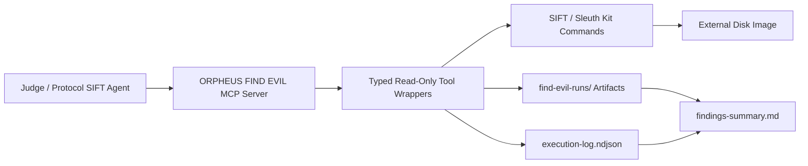

# FIND EVIL Architecture

## Architectural Pattern

Custom MCP Server.

## Security Boundaries

- The MCP server exposes only typed disk-image triage tools.
- It does not expose a generic shell command tool.
- The disk image path must be absolute and external to git.
- Tool outputs are written to the run directory, not back to the evidence path.
- Prompt guardrails are used for analyst behavior, but evidence protection is
  enforced by the tool interface and path checks.

## Tool Sequence

1. `hash_evidence`
2. `inspect_partitions`
3. `list_files`
4. `extract_file_metadata`
5. `build_timeline`
6. `search_indicators`
7. `summarize_findings`

## Self-Correction

When a partition-sensitive command fails, the agent should inspect the
`partitions.txt` artifact, identify the correct offset, and rerun the failed
tool with `offset`.

---

## Reasoning Enhancements

When `enableReasoning: true` is set (via `--enable-reasoning` or `ORPHEUS_FIND_EVIL_ENABLE_REASONING=true`),
the FIND EVIL module wires all 6 AI red-team reasoning enhancements into the DFIR workflow:

### 1. Self-Check

Every tool result gets a `selfCheck` field with:
- **Confidence** (0–1) based on artifact count, success/failure consistency, timing sanity
- **Issues** (hard blockers): missing error on failure, negative timestamps
- **Warnings** (soft signals): empty summary, fewer artifacts than expected, long duration
- **Recommendation**: human-readable verdict

After the full run, a **batch self-check** also detects:
- Duplicate tool executions (possible retry loops)
- Out-of-order execution (e.g., `summarize_findings` before `inspect_partitions`)

Artifact: `self-check.json`

### 2. Reasoning Traces

Each tool logs structured reasoning steps via `createTriageTracer()`:
- **Action**: what the tool tried to do
- **Observation**: raw signal (exit code, output length, offset value)
- **Inference**: what ORPHEUS concluded from that signal

Examples:
- `list_files`: logs "Attempt auto-extract partition offset" → "No offset given" → "Checking prior inspect_partitions artifact"
- `search_indicators`: logs "Run strings" → "Indicators: powershell, rundll32" → "Searching raw image for suspicious printable strings"

At `summarize_findings`, the full case trace is serialized with:
- All per-tool step traces
- Completion gate status
- Batch self-check results

Artifact: `reasoning-trace.json`

### 3. Tool Verification / Completion Gates

`summarize_findings` runs `validateCompletionGate()` over all accumulated results:
- Validates all 7 expected tools are present
- Detects missing tools (e.g., skipped `extract_file_metadata`)
- Detects duplicates (e.g., `list_files` ran twice)
- Detects unexpected tools
- Warns if any tool failed

Artifact: `completion-gate.json`

### 4. Completion Gates

The same gate logic above serves as the DFIR completion gate. The findings summary
includes a "Reasoning Enhancements" section with gate validity, so a judge can
immediately see whether the full 7-tool sequence executed.

### 5. Error Persistence & Trend Comparison

Each reasoning-enabled run is persisted to an in-memory store with:
- Tool count, success/failure count, artifact count, warning count
- Self-check validity and confidence
- Completion gate validity and missing tools

`summarize_findings` auto-compares the current run against the previous run for
the same case:
- **Trend**: improving / worsening / stable
- **Success/failure/warning deltas**
- **New fixed, and persisting failures**

Artifact: `trend-comparison.json`

This enables cross-case regression detection across multiple hackathon submissions
or repeat analyses of the same disk image.

### 6. Executive Assistant Integration

DFIR phases are pushed to the durable executive state (`executive-state.json`):

| Phase | Kind | Trigger |
|---|---|---|
| `case_opened` | priority | `createFindEvilContext` with reasoning on |
| `triage_started` | follow_up | (reserved for future streaming mode) |
| `partition_auto_extracted` | note | Auto-extraction succeeds in `list_files` or `build_timeline` |
| `self_correction_triggered` | risk | `list_files` fails without offset |
| `findings_ready` | decision | `summarize_findings` gate passes |
| `artifacts_persisted` | follow_up | All reasoning artifacts written |

This makes DFIR cases first-class items in ORPHEUS’s executive briefing alongside
coding tasks, security scans, and red-team assessments.

---

## Artifact Map

| File | Source | Contains |
|---|---|---|
| `evidence-hash.json` | `hash_evidence` | SHA-256 of original image |
| `partitions.txt` | `inspect_partitions` | `mmls` output |
| `file-list.txt` | `list_files` | `fls -r -p` output |
| `metadata-<inode>.txt` | `extract_file_metadata` | `istat` output |
| `timeline.body` / `timeline.csv` | `build_timeline` | `fls` bodyfile + `mactime` |
| `indicator-search.json` | `search_indicators` | String matches per indicator |
| `findings-summary.md` | `summarize_findings` | Markdown report with execution trace |
| `execution-log.ndjson` | All tools | Structured per-tool JSON lines |
| `reasoning-trace.json` | `summarize_findings` (reasoning on) | Full case reasoning trace |
| `self-check.json` | `summarize_findings` (reasoning on) | Batch self-check results |
| `completion-gate.json` | `summarize_findings` (reasoning on) | Gate validity + missing tools |
| `trend-comparison.json` | `summarize_findings` (reasoning on) | Cross-run trend analysis |
